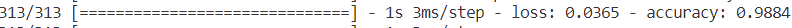
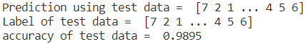

# Convolutional Neural Network (CNN) model for classifying MNIST character 
This CNN model is created for classifying image into 10 categories of MNIST character (0,1,2,3,4,5,6,7,8,9)

## 1. Preparing image data
- The image data such as train and test data will be stored first as a numpy array and save into .npz file for convenience using <a href="create_train_test.py">create_train_test.py</a> file

## 2. CNN architecture
- Before create the model, we should load the train and test data from .npz file. The X_train and X_test will be better if it is normalized (devided by 255.0) in the beginning. the image pixel will become 0-1 and the computation will become easier and faster.

The train data will split into training and validating data as followed:

Architecture of CNN model:
| Layer               | Note                  | Node | num_fiter | filter shape | Activation Function |
| ------------------- | --------------------- | ---- | --------- | ------------ | ------------------- |
| convolutional layer | input_shape=(28,28,1) |      | 32        | 3,3          | relu                |
| max pooling layer   |                       |      |           | 2,2          |                     |
| convolutional layer |                       |      | 64        | 3,3          | relu                |
| max pooling layer   |                       |      |           | 2,2          |                     |
| convolutional layer |                       |      | 64        | 3,3          | relu                |
| flatten layer       | convert to 1D         |      |           |              |                     |
| Dense               |                       | 64   |           |              | relu                |
| Dense               |                       | 10   |           |              | softmax             |

## 3. Training process
Based on loss and accuracy graph, we can see training process with epoch = 3 is enough

## 4. Performance
Performance based on validation data reached accuracy of **0.9884**

Performance based on test data reached accuracy of **0.9895**

