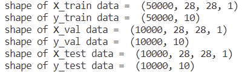
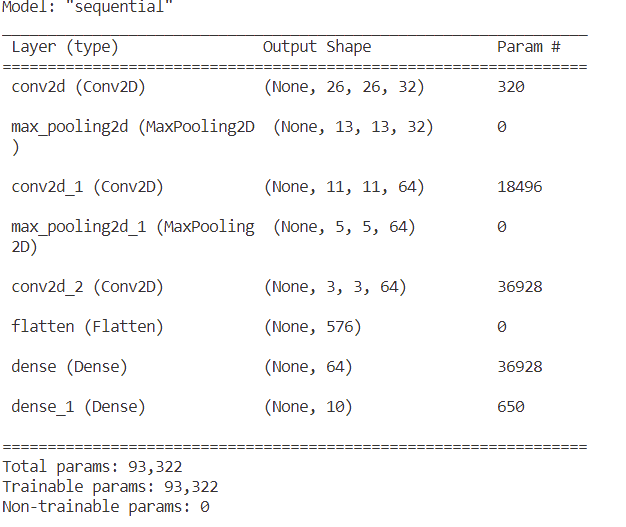
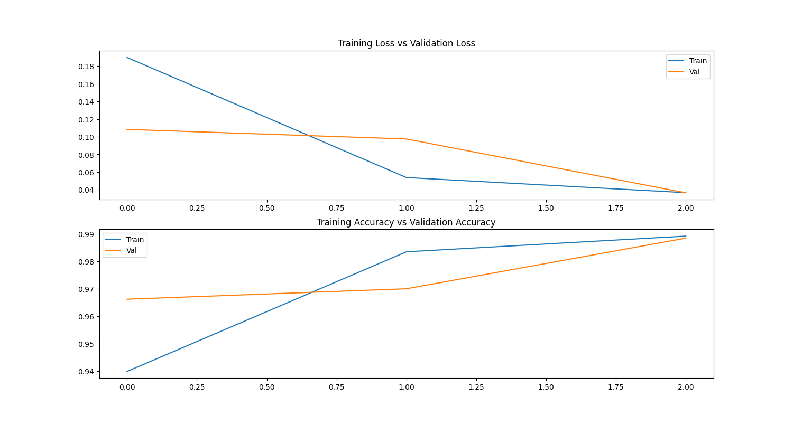
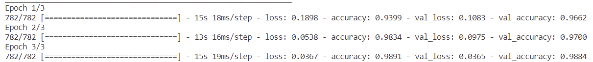

# Convolutional Neural Network (CNN) model for classifying skin cancer
This CNN model is created for classifying image into 2 categories namely, benign and malignant

## 1. Preparing image data
> - The image data such as train and test data will be stored first as a numpy array and save into .npz file for convenience.

## 2. CNN architecture
- Before create the model, we should load the train and test data from .npz file. The X_train and X_test will be better if it is normalized (devided by 255.0) in the beginning. the image pixel will become 0-1 and the computation will become easier and faster.
- the size of input image / input neural network is (224,224,3)
- architecture of CNN:
  - Convolutional 2D, 32 filters with size 3x3
  - Pooling, size 2x2
  - Convolutional 2D, 64 filters with size 3x3
  - Pooling, size 2x2
  - Convolutional 2D, 64 filters with size 3x3
  - Flatten (convert 2d into 1d)
  - Normal Neural network layer with 64 nodes
  - last layer, with 1 node and sigmoid activation function for determine the binary class (benign/malignant)

## 3. Training process

## 4. Performance

