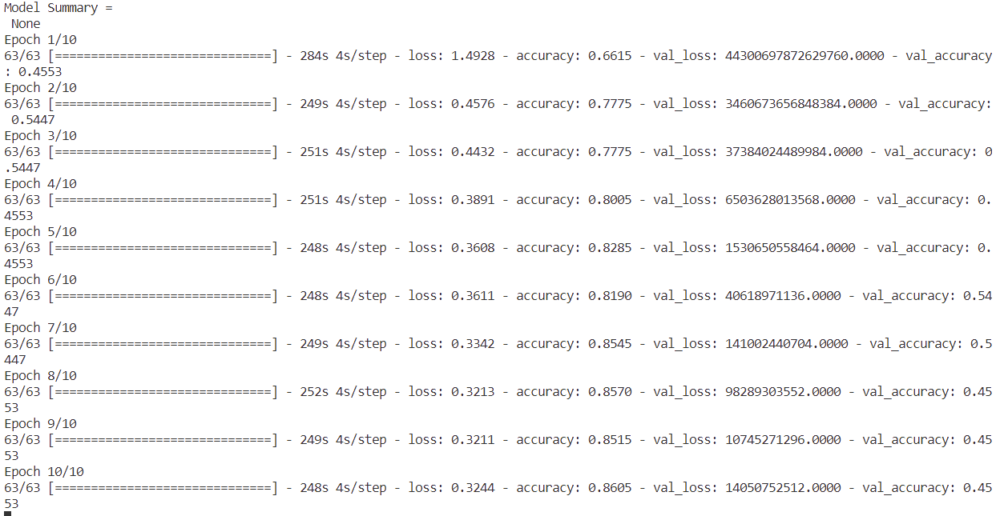
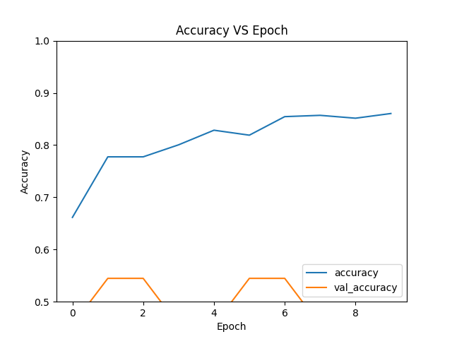
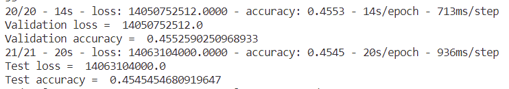

# Convolutional Neural Network (CNN) model for classifying skin cancer
This CNN model is created for classifying image into 2 categories namely, benign and malignant

## 1. Preparing image data
- The image data such as train and test data will be stored first as a numpy array and save into .npz file for convenience.
- The train data will be split into train data and validation data for cnn training process 

## 2. CNN architecture
-  The train, validation and test data will be better if it is normalized (devided by 255.0) in the beginning. the image pixel will become 0-1 and the computation will become easier and faster.
- the size of input image / input neural network is (224,224,3)
- architecture of CNN:
  - this model using NASNetMobile architecture as a base model
  - at the top, the model uses fully connected layer with 1024 node with relu activation layer and output layer (2 nodes) with softmax activation layer
## 3. Training process
- Training process is using adam optimizers with learning rate 0.01
- the loss function is categorical crossentropy
- the training process will be executed with epochs=10

## 4. Performance
This model reach accuracy
- 45.53% when using validation data
- 45.45% when using testing data 

